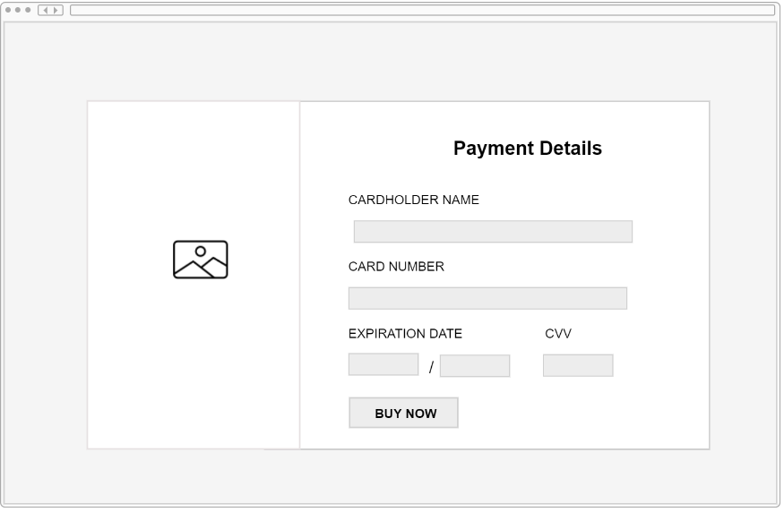
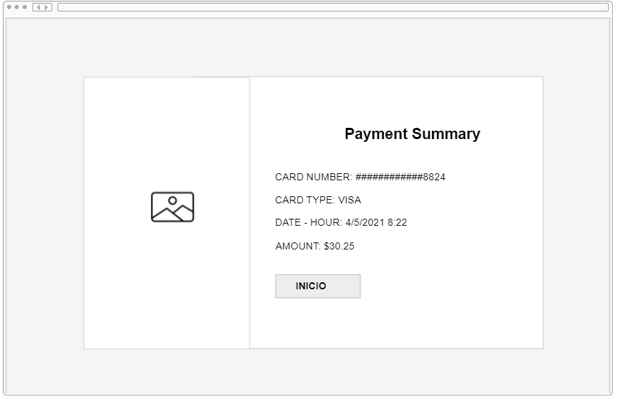

# CARD VALIDATION

## Índice

* [1. Sobre mi proyecto](#1-Sobre-mi-proyecto)
* [2. Imagen del proyecto](#2-Imagen-del-proyecto)
* [3. Investigación UX](#3-investigación-UX)
*    [3.1 Usuarios y Objetivos](#3.1-Usuarios-y-Objetivos)
*    [3.2 Necesidad del usuario](#3.2-Necesidad-del-usuario)
*    [3.3 Prototipado](#3.3-Prototipo)
*    [3.4 Link al Proyecto](#3.4-Link-al-Proyecto)

***

## 1. Sobre mi proyecto

La pagina web esta enfocada a la venta de articulos online, y en este proceso para realizar el pago, existe un ultimo paso que es la Validación de la tarjeta para que el usuario comience a utilizarla, mi proyecto va enfocado a la validacion y la identificacion del Tipo de Tarjeta ingresada. 

## 2. Imagen del proyecto final

## 3. Investigación UX
 
 ## 3.1 Usuarios y Objetivos

#### Usuario
Es la persona que quiere realizar una compra de un articulo de una tienda y desea validar su tarjeta para su compra.
#### Objetivos
1- Que el usuario de forma intuitiva sepa donde ingresar el numero de su tarjeta y demás datos

2- Que al presionar el boton "Buy Now" verifique si la tarjeta es válida y identifique su tipo de tarjeta y pueda regresar a su pantalla inicial.

 ## 3.2 Necesidad del usuario
 El usuario luego de haber recibido su tarjeta necesita estar seguro de que esta puede ser utilizada en su compra, para no llegar al momento de comprar y sorprenderse negativamente con su tarjeta invalida, este sería un gran problema para el usuario el que vamos a resolver agregando este ultimo paso de verificación.

 ## 3.3 Prototipo en papel 
 

 
 
 ## 3.4 Link al Proyecto
 
 https://yovana888.github.io/LIM015-card-validation/src/
